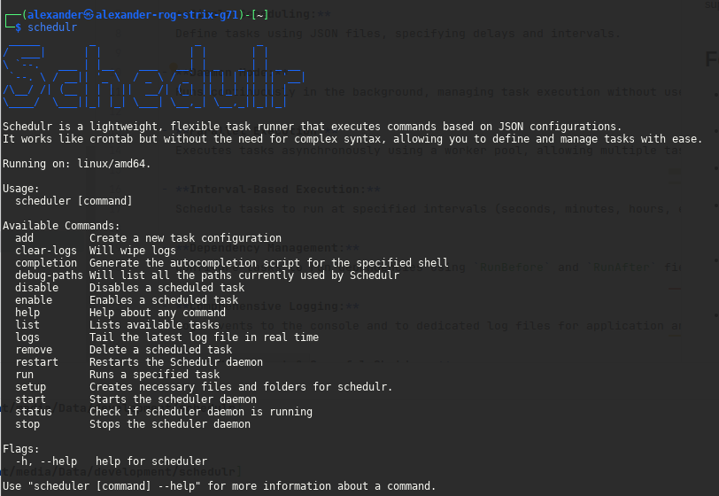

# Schedulr - A Modern Task Scheduler

Schedulr is a lightweight, crontab-inspired task scheduler that executes tasks based on JSON configurations. It supports shell commands and HTTP requests, running as a daemon with configurable execution intervals.



## Features

- **Simple Scheduling:**  
  Define tasks using JSON files, specifying delays and intervals.

- **Daemon Mode:**  
  Runs continuously in the background, managing task execution without user intervention.

- **Parallel Execution:**  
  Executes tasks asynchronously using a worker pool, allowing multiple tasks to run in parallel.

- **Interval-Based Execution:**  
  Schedule tasks to run at specified intervals (seconds, minutes, hours, etc.) based on your JSON configuration.

- **Dependency Management:**  
  Configure tasks to run dependencies using `RunBefore` and `RunAfter` fields, ensuring prerequisite tasks execute in order.

- **Comprehensive Logging:**  
  Logs events to the console and to dedicated log files for application and task events. Real-time log tailing and periodic log wiping features are also provided.

- **PID Management & Graceful Shutdown:**  
  Uses a PID file to prevent multiple instances and supports clean shutdown when receiving termination signals.

## Getting Started

### Prerequisites

- [Go](https://golang.org/dl/) 1.16 or later
- Mac OS / Linux / Windows

### Usage

1. **Download Schedulr**

   Head over to the [Releases](https://github.com/alexanderthegreat96/schedulr/releases) page and download the latest binary for your system architecture.

2. **Install the Binary**

   Move the downloaded `schedulr` binary to a directory of your choice and make it executable:

   ```bash
   chmod +x schedulr
   ```

3. **Run the CLI Helper**

   Launch the built-in help menu to initialize necessary files and view available commands:

   ```bash
   ./schedulr --help
   ```

4. **Create Your First Task**

   Use the `add` command to define a new task. For example:

   ```bash
   ./schedulr add shell "my-task"
   ```

   You can also use `http` as the task type to send HTTP requests.

5. **Manage Your Tasks**

   All created task files will be stored in the `tasks/` directory, organized by type (e.g., `tasks/shell/`, `tasks/http/`).

6. **Start the Scheduler Daemon**

   Start Schedulr in daemon mode to begin automatic execution of your tasks:

   ```bash
   ./schedulr start
   ```

7. **That’s It! 🎉**

   Your tasks will now run automatically based on their configured intervals. Use `schedulr logs` to monitor output in real-time.

---

✅ Need more examples? Run:

```bash
./schedulr help
```


### Developing

1. **Clone the repository:**

   ```bash
   git clone https://github.com/yourusername/schedulr.git
   cd schedulr
   ```

## Usage

### Running the Scheduler

To start Schedulr as a daemon, simply run:

```bash
./schedulr
```

This starts the scheduler loop, which continuously loads tasks from JSON files, schedules them based on their delay and interval configurations, and dispatches them for asynchronous execution.

### Adding Tasks

Use the `add` command to create a new task configuration. Supported task types are:

- `shell`: Executes a shell command.
- `http`: Executes an HTTP request.

Examples:

```bash
./schedulr add shell "Backup Database"
./schedulr add http "Ping API"
```

Task configurations are stored as JSON files in the designated tasks directory.

### Viewing and Managing Logs

Schedulr logs output to both the console and log files. A background log wiper function can be configured to truncate log files every x seconds to prevent indefinite growth.

#### Tailing Logs

Schedulr includes a built-in command to tail the latest log file in real time. For example, to tail the application logs:

```bash
./schedulr logs app
```

Or for task logs:

```bash
./schedulr logs task backup-database
./schedulr logs task ping-api
```

The command finds the most recently modified log file in the appropriate directory and outputs new entries using the application's logging format.

## Command Line Usage

Schedulr provides a command-line interface powered by [Cobra](https://github.com/spf13/cobra)

### 🔤 Command Name Normalization

All command-line arguments are automatically normalized to ensure consistent task matching:

- Any command or task name provided is converted to **PascalCase**, then to **kebab-case**.  
  **Example:**  
  `"Backup Database"` → `"BackupDatabase"` → `"backup-database"`

- When referencing an existing task by name (e.g., from the filesystem or scheduler), the reverse process is applied:  
  **Example:**  
  `"backup-database"` → `"BackupDatabase"`

This ensures that task names are matched reliably regardless of formatting or casing in user input.

### `add`

- **Usage:** `schedulr add [task_type] [task_name]`
- **Description:** Creates a new scheduled task configuration in JSON format.
- **Supported Task Types:**
  - `shell`: Executes a shell command.
  - `http`: Executes an HTTP request.

Examples:

```bash
schedulr add shell backup-database
schedulr add http ping-api
```

### `logs`

- **Usage:** `schedulr logs [log_type] [task_type] [task_name]`
- **Description:** Tails the most recently modified log file in real time.
- **Supported Log Types:**
  - `app`: Application logs.
  - `task`: Task logs.

If no log type is specified, it defaults to `app`.

Examples:

```bash
schedulr logs app
schedulr logs task backup-database
```

### Default Behavior

Running `schedulr` without any arguments starts the scheduler daemon, which continuously processes and schedules tasks.

### Help Command

Use `schedulr help` or `schedulr --help` to view detailed information about all commands and options.

## Task Execution Details

### Scheduling

Every task lives in a plain JSON file that Schedulr watches. **Edit it at any time — every field is hot‑reloaded, no service restart required.**

```jsonc
{
  "name": "MyTask",            // unique, human‑friendly label
  "execution": {
    "interval": {               // run *again* after this span
      "years":   0,
      "months":  0,
      "weeks":   0,
      "days":    0,
      "hours":   0,
      "minutes": 0,
      "seconds": 0
    },
    "delay": {                  // optional pause *before* first run
      "years":   0,
      "months":  0,
      "weeks":   0,
      "days":    0,
      "hours":   0,
      "minutes": 0,
      "seconds": 0
    },
    "last_ran_at": "",         // auto‑filled timestamp (RFC 3339)
    "run_before": "",          // a different task set in here like: AnotherTask
    "run_after":  "",          // same as above, run after THIS GIVEN TASK -> just a task name
    "is_enabled": false         // flip to true to activate
  },
  "command":    "",            // exact shell line to execute
  "shell_type": ""             // linux / macos use the default execution agent. For windows use: cmd / powershell
}
```

### How Schedulr interprets the fields

| Field                        | Meaning                                                                                      |
| ---------------------------- | -------------------------------------------------------------------------------------------- |
| **delay**                    | Wait this long *after enabling* before the very first run.                                   |
| **interval**                 | How long to wait *after each run* before scheduling the next one. All zeros → one‑shot task. |
| **last\_ran\_at**            | Updated by Schedulr; normally leave it alone.                                                |
| **run\_after / run\_before** | Define a window. If now < run\_after or now > run\_before the task is skipped.               |
| **is\_enabled**              | Master on/off switch. `false` pauses without resetting counters.                             |

All numeric sub‑fields accept any non‑negative integer, so you can express everything from **“every 90 seconds”** (`seconds = 90`) to **“once a quarter”** (`months = 3`).

### Choosing a shell

| Platform      | Default | Accepted values for `shell_type`                |
| ------------- |---------| ----------------------------------------------- |
| Windows       | `cmd`   | `cmd` (default)  •  `powershell`                |
| Linux / macOS | `bash`  | Any executable on `$PATH` (e.g., `bash`, `zsh`) |

*Leave **`shell_type`** empty to use the default above.* Specify `"powershell"` on Windows for cmdlet goodness, or `"cmd"` for classic batch syntax.


### Dependencies

Tasks can be configured to run dependencies before or after the main task using `RunBefore` and `RunAfter` in the JSON configuration. The scheduler respects these dependencies by waiting for the dependent task’s scheduled time before executing.

### HTTP Task Execution

HTTP tasks support configurable methods, headers, and optional JSON bodies. Schedulr creates and sends HTTP requests, logs response status and body, and handles errors accordingly.

## Configuration

- **Task Directory:**  
  Task configurations are stored as JSON files under a specified directory, as defined in your configuration file.

- **Log File Paths:**  
  Set paths for your application and task log files using the `AppLogFilePath` and `TasksLogFilePath` environment variables.

- **Interval Settings:**  
  Control task execution timing via JSON fields for delay and interval (using units like seconds, minutes, and hours).


## Available Commands

| Command      | Description                                                |
|--------------|------------------------------------------------------------|
| `add`        | Create a new task configuration                            |
| `remove`     | Deletes a task configuration                               |
| `clear-logs` | Wipe log files                                             |
| `completion` | Generate the autocompletion script for the specified shell |
| `help`       | Help about any command                                     |
| `list`       | Lists available tasks                                      |
| `logs`       | Check logs for both tasks and app logs                     |
| `run`        | Runs a specified task                                      |
| `setup`      | Creates necessary files and folders for Schedulr           |
| `start`      | Starts the scheduler daemon                                |
| `status`     | Check if scheduler daemon is running                       |
| `stop`       | Stops the scheduler daemon                                 |
| `enable`     | Enables a task                                             |
| `disable`    | Disables a task                                            |

# Setting up Schedulr as a Service

## ✅ Linux (systemd)

### Create the service entry
```bash 
vim /etc/systemd/system/schedulr.service
```

### Service File Contents
```ini
[Unit]
Description=Schedulr background service
After=network.target

[Service]
Type=simple
ExecStart=/home/your-username/schedulr/schedulr start
WorkingDirectory=/home/your-username/schedulr
Restart=on-failure
RestartSec=5
User=your-username

[Install]
WantedBy=default.target
```

### Enable and Start the Service
```bash
sudo systemctl daemon-reload
sudo systemctl enable schedulr
sudo systemctl start schedulr
sudo systemctl status schedulr
```

---

## ✅ macOS (launchd)

### Create the launchd service file

**For user services:**
```bash
vim ~/Library/LaunchAgents/com.yourusername.schedulr.plist
```

**For system-wide services:**
```bash
sudo vim /Library/LaunchDaemons/com.yourusername.schedulr.plist
```

### Service File Contents (User version)
```xml
<?xml version="1.0" encoding="UTF-8"?>
<!DOCTYPE plist PUBLIC "-//Apple//DTD PLIST 1.0//EN" 
  "http://www.apple.com/DTDs/PropertyList-1.0.dtd">
<plist version="1.0">
<dict>
    <key>Label</key>
    <string>com.yourusername.schedulr</string>

    <key>ProgramArguments</key>
    <array>
        <string>/Users/your-username/schedulr/schedulr</string>
        <string>start</string>
    </array>

    <key>WorkingDirectory</key>
    <string>/Users/your-username/schedulr</string>

    <key>RunAtLoad</key>
    <true/>

    <key>KeepAlive</key>
    <true/>

    <key>StandardOutPath</key>
    <string>/tmp/schedulr.log</string>

    <key>StandardErrorPath</key>
    <string>/tmp/schedulr.err</string>
</dict>
</plist>
```

### Load and Start the Service
```bash
launchctl load ~/Library/LaunchAgents/com.yourusername.schedulr.plist
launchctl start com.yourusername.schedulr
launchctl bootstrap gui/$(id -u) ~/Library/LaunchAgents/com.yourusername.schedulr.plist
```

### Stop or Unload the Service
```bash
launchctl stop com.yourusername.schedulr
launchctl unload ~/Library/LaunchAgents/com.yourusername.schedulr.plist
```
## Licence
### MIT License

#### Copyright (c) [2025] [alexanderthegreat96]

Permission is hereby granted, free of charge, to any person obtaining a copy
of this software and associated documentation files (the “Software”), to deal
in the Software without restriction, including without limitation the rights  
to use, copy, modify, merge, publish, distribute, sublicense, and/or sell  
copies of the Software, and to permit persons to whom the Software is  
furnished to do so, subject to the following conditions:

The above copyright notice and this permission notice shall be included in  
all copies or substantial portions of the Software.

THE SOFTWARE IS PROVIDED “AS IS”, WITHOUT WARRANTY OF ANY KIND, EXPRESS OR  
IMPLIED, INCLUDING BUT NOT LIMITED TO THE WARRANTIES OF MERCHANTABILITY,  
FITNESS FOR A PARTICULAR PURPOSE AND NONINFRINGEMENT. IN NO EVENT SHALL THE  
AUTHORS OR COPYRIGHT HOLDERS BE LIABLE FOR ANY CLAIM, DAMAGES OR OTHER  
LIABILITY, WHETHER IN AN ACTION OF CONTRACT, TORT OR OTHERWISE, ARISING FROM,  
OUT OF OR IN CONNECTION WITH THE SOFTWARE OR THE USE OR OTHER DEALINGS IN  
THE SOFTWARE.
